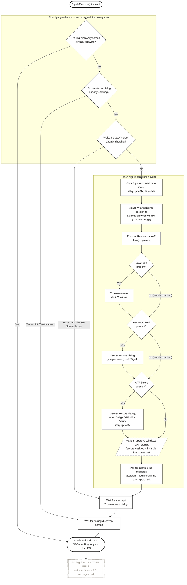

# Target PC Sign-In Flow

Current implementation scope: **Target PC only.** Source PC has no authentication step,
confirmed directly during this build -- the flow below lives entirely under
`flows/target/authentication/sign_in_flow.py` and the Page Objects in
`components/target/`. There is no parameterize-by-role version of this flow and there
will not be one.

Legend: solid outline = automated step (implemented and exercised live); diamond =
decision/presence check; dashed outline = manual step requiring a human; dotted gray =
not yet built.

## Notes on confidence

- **Confirmed** -- every automated node (solid outline) has been exercised against the
  live Target PC build, including all three already-signed-in shortcuts.
- **Confirmed** -- root cause of an earlier "Sign In button not found" failure: the
  app's own silent OIDC token refresh (`TrySilentLoginAsync`) can skip the Welcome screen
  entirely -- not a crash, confirmed via the app's own log file.
- **Unconfirmed** -- the "Welcome back" screen's Get Started button locator, and the
  email/password step locators, are inferred from user-supplied screenshots only -- the
  test browser profile has retained an existing session on every live run so far, so
  these exact paths have not yet fired for real.
- **Manual** -- the Windows UAC prompt runs on the secure desktop and is categorically
  invisible to UI Automation/WinAppDriver in any tool (WinAppDriver, Selenium,
  Playwright) -- a human must click Yes. The flow detects approval indirectly via the
  "Starting the migration assistant" modal.
- **Out of scope** -- everything past the pairing-discovery screen (actual pairing with
  Source PC) is not yet built -- blocked on a Coordination Service and real locators for
  the pairing-code screens.

**Source**: `flows/target/authentication/sign_in_flow.py`;
`components/target/sign_in_screen.py`, `common_dialogs.py`, `browser_sign_in_page.py`,
`pairing_discovery_screen.py`; `factory/browser_driver_factory.py`.
